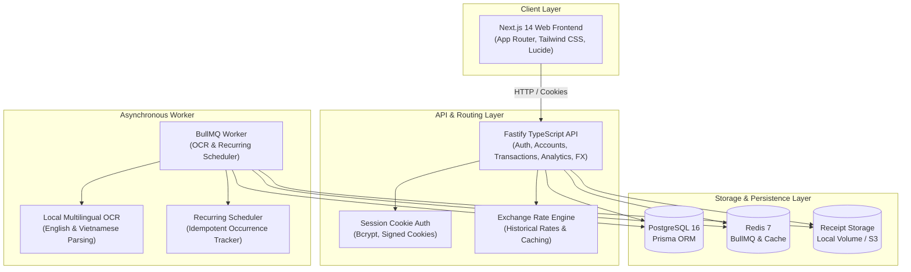

# PocketLens

> Multilingual personal finance platform combining instant transaction entry, English/Vietnamese receipt OCR, budget management, recurring subscriptions, multi-currency reporting, and spending analytics.

[](https://github.com/t0e/pocker-lens/actions/workflows/ci.yml)
[](https://nodejs.org/)
[](https://www.typescriptlang.org/)
[](https://www.docker.com/)
[](https://www.postgresql.org/)
[](https://redis.io/)

---

## 💡 Why PocketLens?

Managing personal finances across multiple currencies and languages is usually slow, tedious, or lossy. Existing tools often force automatic currency conversions that overwrite original transaction values or rely on brittle manual data entry.

**PocketLens is built on six foundational invariants:**

1. **Original Money Immutability**: Every transaction permanently retains its original currency and amount in the database. Converted views are computed dynamically for reporting and never overwrite the underlying financial record.
2. **Exact Decimal Precision**: All balances, transaction amounts, and exchange rates are handled with exact decimal arithmetic (`DECIMAL(19, 4)` and `DECIMAL(18, 8)` in PostgreSQL) to eliminate floating-point rounding errors.
3. **Strict Transfer Semantics**: Internal transfers between accounts adjust individual account balances without inflating total income, expenses, or net worth.
4. **Receipt Human-in-the-Loop Confirmation**: Receipt uploads and OCR extractions never modify financial balances until explicitly reviewed and confirmed by the user.
5. **Idempotent Recurring Execution**: Background recurring schedulers ensure that scheduled payments execute exactly once per cycle, even in concurrent or restarted environments.
6. **Multi-Tenant User Isolation**: All accounting ledgers, receipt images, category learning suggestions, and duplicate alerts are strictly scoped to the authenticated user.

---

## 🏗 Architecture



---

## ⚡ Key Financial Workflows

### 1. Receipt Capture & OCR Pipeline
```text
Receipt Upload (JPG/PNG/WebP/PDF)
       ↓
Magic-Byte & MIME Validation (≤ 10MB)
       ↓
Persistent Storage (Local Volume / S3)
       ↓
BullMQ Job Enqueue
       ↓
Worker OCR Extraction (English + Vietnamese)
       ↓
Interactive Side-by-Side Review UI
       ↓
User Confirmation → Transaction Service → Account Balance Update
```

### 2. Unified Transaction Service
```text
Manual Entry / Quick Add / OCR Confirm / Recurring Scheduler
       ↓
Existing Transaction Service
       ↓
Atomic Account Balance Adjustment (PostgreSQL Transaction)
       ↓
Dynamic Budget Spending & Net Worth Updates
```

### 3. Multi-Currency Reporting & Historical FX
* **Historical Flows**: Transactions from past dates are converted using the exchange rate recorded on that exact transaction date.
* **Current Net Worth & Balances**: Account balances convert dynamically using the latest active exchange rates.
* **Missing Rate Resilience**: Missing exchange rates return `null` and mark conversion unavailable rather than falling back to an inaccurate 1:1 rate.

### 4. Deterministic Intelligence & Duplicate Protection
* **Merchant Normalization**: Standardizes casing, spacing, and punctuation (e.g., `HIGHLANDS COFFEE` and `Highlands Coffee` map to `highlands coffee`).
* **User-Isolated Category Learning**: Suggests categories based strictly on the user's historical confirmations for that merchant.
* **Duplicate Detection**: Flags potential duplicates within $\pm 24\text{ hours}$ based on account, amount, currency, and merchant. Offers users `Keep Both`, `Use Existing` (links receipt), or `Cancel`.

---

## 🛠 Tech Stack

| Domain | Technologies |
| :--- | :--- |
| **Frontend** | Next.js 14 (App Router), React 18, Tailwind CSS, Lucide Icons |
| **Backend API** | Node.js 20, Fastify, TypeScript, Prisma ORM, Zod, Pino |
| **Worker & Queue** | Node.js 20, BullMQ, Redis 7, Tesseract.js OCR |
| **Database** | PostgreSQL 16 (Exact `DECIMAL` columns, composite indexes) |
| **Storage** | Local volume mount (`/data/receipts`) / S3-compatible provider |
| **Orchestration** | Docker, Docker Compose (Multi-stage Alpine images) |
| **CI/CD** | GitHub Actions (Lint, type-check, integration tests, build) |

---

## 🚀 Quick Start (Local Development)

### Prerequisites
* [Docker](https://docs.docker.com/get-docker/) & Docker Compose
* [Node.js](https://nodejs.org/) v20+ (for local host scripting/testing)

### 1. Clone & Configure
```bash
git clone https://github.com/t0e/pocker-lens.git
cd pocker-lens
cp .env.example .env
```

### 2. Start Services
```bash
docker compose up --build
```

Docker Compose automatically orchestrates startup in the correct sequence:
1. `postgres` (PostgreSQL 16) & `redis` (Redis 7) initialize and become healthy.
2. `migrate` runs `prisma migrate deploy` and exits cleanly.
3. `api` (Fastify API) & `worker` (BullMQ worker) start concurrently with the schema fully prepared.
4. `web` (Next.js frontend) launches and connects to the API.

### 3. Access Services
* **Web Application**: [http://localhost:3000](http://localhost:3000)
* **API Health Check**: [http://localhost:4000/health](http://localhost:4000/health)
* **API Readiness Probe**: [http://localhost:4000/ready](http://localhost:4000/ready)

### 4. Stop Services
```bash
docker compose down
```
*(Volumes `postgres_data`, `redis_data`, and `receipt_data` persist data across restarts).*

---

## 🧪 Testing & Verification

PocketLens includes comprehensive automated test coverage across shared logic and API integration:

```bash
# Run shared package unit tests (76 tests)
npm test --workspace=@pocketlens/shared

# Run API integration tests against database & Redis (97 tests)
npm test --workspace=@pocketlens/api

# Run full monorepo type-checking
npm run type-check

# Run full monorepo linting
npm run lint

# Build all applications and packages for production
npm run build
```

---

## 🔒 Security & Privacy

* **Authentication**: Bcrypt password hashing (`cost factor 10`), server-side persistent sessions in PostgreSQL, signed `HttpOnly`, `SameSite=Lax` cookies.
* **CORS & Origin Security**: Configurable allowed origins (`ALLOWED_ORIGINS`) with credentialed requests.
* **Upload Protections**: Strict file size limits (10 MB), magic-byte file signature validation, sanitized unique storage keys (`cuid()`), and user ownership verification before receipt access.
* **Error Sanitization**: Production API responses sanitize internal 500 errors to prevent leakage of database schemas, system paths, or library internals.
* **No Telemetry / No Paid Third-Party Dependencies**: OCR and parsing run locally without leaking financial documents to third-party AI APIs.

---

## ⚠️ Known Limitations

* **No Automatic Bank Syncing**: PocketLens focuses on privacy-friendly manual entry, quick text parsing, and receipt scanning. Direct Open Banking / Plaid integrations are intentionally excluded.
* **OCR Quality Dependency**: Receipt parsing accuracy depends on photo resolution, lighting, and receipt print condition. The UI provides a side-by-side verification editor to correct extracted fields.
* **Cross-Currency Transfers**: Transfers between accounts of different currencies are currently recorded as distinct transactions rather than an integrated FX transfer order.
* **Development vs Production Storage**: Development uses a persistent Docker named volume. Production deployments should configure an S3-compatible object store (e.g. AWS S3, Cloudflare R2, or MinIO).

---

## 📁 Repository Structure

```text
pocket-lens/
├── apps/
│   ├── web/                    # Next.js 14 App Router frontend
│   │   ├── src/app/            # Pages: Dashboard, Accounts, Transactions, Budgets, Analytics, Receipts
│   │   └── src/components/     # Layout, charts, modals, review editors
│   ├── api/                    # Fastify Node.js backend
│   │   ├── prisma/             # Database schema and migrations
│   │   └── src/                # Services: Auth, Accounts, Transactions, Budgets, FX, Duplicates
│   └── worker/                 # Background processor
│       └── src/                # BullMQ worker, OCR extraction, Recurring scheduler
├── packages/
│   └── shared/                 # Core domain types, FX math, natural language parser, schemas
├── docker/                     # Optimized multi-stage Dockerfiles (api, worker, web)
├── .github/workflows/          # Production CI workflow (lint, test, build)
├── docker-compose.yml          # Local container orchestrator with dedicated migration container
└── .env.example                # Environment configuration template
```

---

## 📄 License

MIT License. Copyright (c) 2026 PocketLens Contributors.
