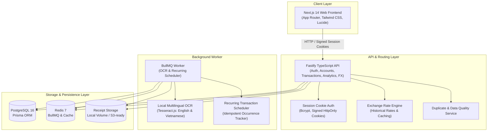

# PocketLens — System Architecture & Technical Specifications

This document is the persistent technical specification and architecture reference for **PocketLens**. It describes how the system is designed, its core accounting invariants, database models, processing pipelines, and operational behavior.

---

## 1. System Overview

PocketLens is a privacy-first, multi-currency personal finance and expense tracking platform. It is engineered around strict financial invariants, local OCR processing without third-party AI APIs, deterministic financial intelligence, and multi-tenant user isolation.

### High-Level Architecture



---

## 2. Monorepo & Package Structure

PocketLens is organized as an **npm workspaces** monorepo:

```text
pocket-lens/
├── apps/
│   ├── api/                 # Fastify REST API backend (TypeScript, Node.js)
│   │   ├── prisma/          # Prisma schema, migrations, seed data
│   │   └── src/
│   │       ├── auth/        # Session token hashing and validation
│   │       ├── config/      # Environment configuration (Zod validation)
│   │       ├── db/          # Prisma client singleton
│   │       ├── plugins/     # Fastify auth, cookies, CORS, and security plugins
│   │       ├── routes/      # Endpoints (auth, accounts, categories, transactions, receipts, budgets, recurring, analytics, fx)
│   │       ├── services/    # Business services (transactions, recurring, duplicates, categorization, fx)
│   │       └── app.ts       # Fastify instance builder
│   ├── web/                 # Next.js 14 App Router frontend (React 18, Tailwind CSS, Lucide icons)
│   │   └── src/
│   │       ├── app/         # Next.js routes (/, /login, /register, /transactions, /accounts, /receipts, /budgets, /analytics, /settings)
│   │       ├── components/  # Modals, navigation, charts, review editors, UI primitives
│   │       ├── context/     # AuthContext (cookie-based session state)
│   │       └── lib/         # API client & currency formatting utilities
│   └── worker/              # Background BullMQ worker for receipt OCR and recurring scheduler
│       └── src/
│           ├── config/      # Worker environment configuration
│           ├── ocr/         # Tesseract.js OCR engine wrapper (eng + vie)
│           ├── processor/   # Receipt extraction pipeline
│           ├── queue/       # Redis / BullMQ connection
│           └── scheduler/   # Periodic recurring transaction runner
├── packages/
│   └── shared/              # Shared types, Zod schemas, date math, receipt parsers, storage contracts
│       └── src/
│           ├── account/     # Account validation schemas
│           ├── auth/        # Auth DTOs & password requirements
│           ├── budget/      # Budget DTOs, schemas, and month bound helpers
│           ├── category/    # Category types & default category list
│           ├── currency/    # Currency codes, decimal places, formatting
│           ├── duplicate/   # Duplicate transaction matching rules
│           ├── fx/          # Exchange rate interfaces & conversion helpers
│           ├── ocr/         # OCR result interfaces
│           ├── parser/      # Deterministic bilingual (EN/VI) receipt parser & dictionary
│           ├── queue/       # BullMQ queue names and job payload interfaces
│           ├── receipt/     # Receipt DTOs and MIME validations
│           ├── recurring/   # Recurrence frequency, clamping date math, projection calculators
│           ├── storage/     # Storage abstraction (Local disk / S3-ready)
│           └── transaction/ # Transaction schemas & cashflow calculation
├── docker/                  # Multi-stage Dockerfiles for api, worker, and web
├── docker-compose.yml       # Production/local multi-service orchestration
└── docs/                    # Architecture and project documentation
```

---

## 3. Technology Stack

| Layer                    | Technologies                                                                                                        |
| :----------------------- | :------------------------------------------------------------------------------------------------------------------ |
| **Runtime & Language**   | Node.js 20 LTS, TypeScript 5.4+ (strict mode across all packages)                                                   |
| **Monorepo Manager**     | npm workspaces                                                                                                      |
| **Backend API**          | Fastify v4 (`@fastify/cors`, `@fastify/cookie`, `@fastify/helmet`, `@fastify/multipart`, `@fastify/sensible`), Pino |
| **Frontend UI**          | Next.js 14 (App Router, React 18), Tailwind CSS, Lucide React                                                       |
| **Database & ORM**       | PostgreSQL 16, Prisma ORM v5                                                                                        |
| **Task Queue & Caching** | Redis 7, BullMQ v5                                                                                                  |
| **OCR Engine**           | Tesseract.js (local OCR with `eng` and `vie` language packs)                                                        |
| **Validation**           | Zod (shared across frontend, API, and worker)                                                                       |
| **Testing**              | Vitest across all workspaces                                                                                        |
| **Orchestration**        | Docker, Docker Compose                                                                                              |

---

## 4. Core Accounting & Financial Invariants

All features and modifications in PocketLens must conform to these invariants:

1. **Original Money Immutability**:
   - Every transaction permanently retains its original currency and amount in the database (`Transaction.amount` and `Transaction.currency`).
   - Currency conversions are derived dynamically for reporting views and never overwrite or mutate the underlying transaction ledger.
2. **Exact Decimal Precision**:
   - Monetary balances and transaction amounts use `Decimal(19, 4)` in PostgreSQL.
   - Exchange rates use `Decimal(18, 8)` precision.
   - Floating-point arithmetic is never used for financial calculations.
3. **Strict Transfer Semantics**:
   - `TRANSFER` transactions require matching currencies between source and destination accounts.
   - Transfers debit the source account (`-amount`) and credit the destination account (`+amount`).
   - Transfers are **never** counted as income or expense and **never** affect category budgets.
   - Internal transfers do not alter overall net worth.
4. **Mandatory Human-in-the-Loop Receipt Confirmation**:
   - Receipt uploads and OCR extractions create review drafts (`ReceiptExtraction` in `READY_FOR_REVIEW` status).
   - An OCR extraction **must never** automatically create a ledger transaction until explicitly reviewed and confirmed by the user in the UI.
5. **Idempotent Recurring Execution**:
   - Background recurring scheduler execution is protected by a unique database constraint (`RecurringOccurrence: @@unique([recurringTransactionId, scheduledFor])`).
   - Scheduled occurrences execute exactly once per cycle regardless of process crashes or container restarts.
6. **Multi-Tenant User Isolation**:
   - All accounts, transactions, receipts, category learning models, duplicate alerts, and data quality metrics are strictly scoped to the authenticated user ID (`userId`). Cross-tenant leakage is prevented at the database query level.
7. **Multi-Currency Strictness**:
   - Account balances and budgets are maintained independently per ISO currency code.
   - Cross-currency aggregations require explicit exchange rate lookups; missing exchange rates mark converted figures as unavailable rather than falling back to an inaccurate 1:1 rate.

---

## 5. Database Architecture & Key Models

The database schema is defined in `apps/api/prisma/schema.prisma`.

### Key Models & Constraints

- **`User`**:
  - Fields: `id`, `email`, `passwordHash`, `displayName`, `reportingCurrency` (default: `'USD'`), timestamps.
  - Relations: Owns all accounts, transactions, categories, receipts, budgets, recurring transactions, and sessions.
- **`Session`**:
  - Fields: `id`, `tokenHash` (SHA-256 hash of random session token), `userId`, `expiresAt`, `createdAt`.
  - State-backed session authentication with revocation capability.
- **`Account`**:
  - Fields: `id`, `userId`, `name`, `type` (`CHECKING`, `SAVINGS`, `CREDIT_CARD`, `CASH`, `INVESTMENT`, `OTHER`), `currency`, `openingBalance` (`Decimal(19, 4)`), `currentBalance` (`Decimal(19, 4)`), `isArchived`, `isDefault`, timestamps.
  - `currentBalance` is updated atomically inside PostgreSQL transactions whenever associated transactions are created, edited, or deleted.
- **`Category`**:
  - Fields: `id`, `userId` (nullable for system categories), `name`, `type` (`EXPENSE`, `INCOME`), `icon`, `color`, `isSystem`, `isArchived`, timestamps.
  - Unique constraint: `@@unique([userId, name, type])`.
- **`Transaction`**:
  - Fields: `id`, `userId`, `type` (`EXPENSE`, `INCOME`, `TRANSFER`), `accountId`, `transferAccountId` (nullable, for transfers), `categoryId` (nullable for transfers), `amount` (`Decimal(19, 4)`), `currency`, `transactionDate`, `description`, `merchant` (nullable), `notes` (nullable), `receiptId` (nullable, 1-to-1), `recurringTransactionId` (nullable), timestamps.
  - Composite indexes: `[userId, transactionDate]`, `[userId, type, transactionDate]`, `[userId, currency, transactionDate]`, `[userId, categoryId, transactionDate]`, `[userId, merchant]`.
- **`Receipt`**:
  - Fields: `id`, `userId`, `storagePath`, `fileName`, `fileSize`, `mimeType`, `status` (`UPLOADED`, `PROCESSING`, `READY_FOR_REVIEW`, `CONFIRMED`, `FAILED`), timestamps.
- **`ReceiptExtraction`**:
  - Fields: `id`, `receiptId` (unique 1-to-1), `merchantName`, `totalAmount` (`Decimal(19, 4)`), `taxAmount` (`Decimal(19, 4)`), `receiptDate`, `language`, `confidenceScore` (`Float`), `rawText`, timestamps.
- **`ReceiptItem`**:
  - Fields: `id`, `extractionId`, `description`, `quantity` (`Decimal(10, 3)`), `unitPrice` (`Decimal(19, 4)`), `totalPrice` (`Decimal(19, 4)`).
- **`Budget`**:
  - Fields: `id`, `userId`, `categoryId`, `amount` (`Decimal(19, 4)`), `currency`, `month` (string format: `YYYY-MM`), timestamps.
  - Unique constraint: `@@unique([userId, categoryId, currency, month])` ensures exactly one budget per category-currency-month tuple.
- **`RecurringTransaction`**:
  - Fields: `id`, `userId`, `type` (`EXPENSE`, `INCOME`, `TRANSFER`), `accountId`, `transferAccountId`, `categoryId`, `amount` (`Decimal(19, 4)`), `currency`, `frequency` (`DAILY`, `WEEKLY`, `MONTHLY`, `YEARLY`), `interval` (integer), `startDate`, `nextRunDate`, `endDate` (nullable), `isActive`, `isSubscription`, `merchant` (nullable), `description`, timestamps.
- **`RecurringOccurrence`**:
  - Fields: `id`, `recurringTransactionId`, `scheduledFor` (`DateTime`), `executedAt` (`DateTime`), `transactionId` (nullable).
  - Unique constraint: `@@unique([recurringTransactionId, scheduledFor])` provides database-level idempotency against duplicate runs.
- **`ExchangeRate`**:
  - Fields: `id`, `baseCurrency`, `quoteCurrency`, `rate` (`Decimal(18, 8)`), `rateDate` (`DateTime`), `provider`, `fetchedAt`.
  - Unique constraint: `@@unique([baseCurrency, quoteCurrency, rateDate, provider])`.

---

## 6. Subsystem Workflows & Specifications

### 6.1 Authentication & Session Security

- **Password Storage**: Passwords hashed with `bcryptjs` (salt cost factor 10).
- **Session Tokens**: Cryptographically secure random tokens generated at login. The SHA-256 hash of the token is persisted in the `Session` table.
- **Cookies**: Fastify issues signed, `HttpOnly`, `SameSite=Lax` session cookies.
- **Revocation**: Logging out deletes the database session record, immediately invalidating the cookie token.

### 6.2 Receipt & OCR Extraction Pipeline

```text
1. Upload: Client posts image/PDF (JPEG, PNG, WebP, HEIC, PDF) via multipart upload.
2. Validation: Fastify validates MIME type and verifies magic bytes (max 10MB).
3. Storage: Stored via storage abstraction (Local volume `/data/receipts/<userId>/<cuid>.<ext>` or S3).
4. Queue: BullMQ enqueues job on `receipt-processing` queue with `{ receiptId, userId, storagePath }`.
5. Worker Execution:
   - Worker retrieves receipt file from storage.
   - Preprocessing with Sharp (normalization, rotation correction, resizing).
   - Tesseract.js extracts bilingual text (`eng+vie`).
   - Deterministic Regex & Dictionary Parser parses total, tax, date, merchant, and line items.
   - Saves `ReceiptExtraction` and `ReceiptItem` records; marks `Receipt.status = READY_FOR_REVIEW`.
6. Side-by-Side Review: UI presents image alongside extracted fields with editable inputs.
7. Confirmation: User confirms/edits draft -> API transaction service writes `Transaction` and marks `Receipt.status = CONFIRMED`.
```

### 6.3 Budgeting & Spending Engine

- **Derived Spending**: Category spending is never stored as a mutable balance column. It is computed in real time from `Transaction` table (`type === 'EXPENSE'`, matching `categoryId`, matching `currency`, and `transactionDate` within UTC month bounds).
- **Single Aggregation Query**: Monthly budget metrics are fetched via `prisma.transaction.groupBy({ by: ['categoryId', 'currency'] })`, avoiding N+1 queries.
- **Budget Health Statuses**:
  - `0% - 79%`: `NORMAL` (Emerald)
  - `80% - 99%`: `WARNING` (Amber)
  - `100%+`: `OVER_BUDGET` (Rose) with exact overage calculation.
- **Expense Category Restriction**: Budgets can only be assigned to `EXPENSE` categories; `INCOME` categories are rejected with `400 Bad Request`.
- **Month Copying**: `POST /budgets/copy` duplicates prior month budget templates to a target month, skipping categories that already have a budget configured.

### 6.4 Recurring Transactions & Subscriptions Engine

- **Anchor-Preserving Date Math**:
  - Monthly recurrence handles short months and leap years without drifting:
    - `Jan 31` -> `Feb 28` (or `Feb 29`) -> `Mar 31` (anchor day restored) -> `Apr 30` -> `May 31`.
  - Yearly leap year recurrence: `Feb 29, 2024` -> `Feb 28, 2025` -> `Feb 29, 2028`.
- **Subscriptions**:
  - Recurring items flagged with `isSubscription: true` compute normalized estimated monthly costs (`calculateEstimatedMonthlyCost`) for weekly, monthly, and yearly intervals.
- **Upcoming Projections**:
  - `GET /recurring/upcoming?days=30` projects upcoming occurrences over the forecast window without writing to the database or altering account balances.
- **Worker Scheduler**:
  - Periodically queries active templates (`isActive === true && nextRunDate <= now`).
  - Executes transaction creation and logs `RecurringOccurrence` inside an atomic transaction.
  - Automatically advances `nextRunDate`; deactivates the template if `endDate` is reached or if the underlying account is archived.

### 6.5 Multi-Currency & Historical FX Engine

- **Rate Precision**: Exchange rates stored at `Decimal(18, 8)` precision in `ExchangeRate` table.
- **Historical vs. Net Worth Conversion**:
  - **Historical Cashflows**: Converted using the exchange rate effective on the transaction's specific `transactionDate`.
  - **Account Balances & Net Worth**: Converted using the latest available exchange rate for the user's selected `reportingCurrency`.
- **Missing Rate Handling**: When a currency conversion rate is unavailable, converted metrics return `null` and mark conversion as unavailable rather than falling back to an unverified 1:1 rate.

### 6.6 Deterministic Financial Intelligence & Data Quality

- **Merchant Normalization**: Standardizes casing, trims whitespace, removes non-alphanumeric noise (e.g. `HIGHLANDS COFFEE #12` -> `highlands coffee`).
- **User-Isolated Category Learning**: Suggests categories based on user-confirmed historical transactions (`userId + normalized_merchant`) and description keywords, classified with confidence scores (`HIGH`, `MEDIUM`, `LOW`, `NONE`).
- **Duplicate Detection**: Flags potential duplicates within $\pm 24\text{ hours}$ based on user, account, currency, amount, and merchant. Offers three resolution choices: `Keep Both`, `Use Existing` (links receipt), or `Cancel`.
- **Deterministic Spending Insights**: Generates factual insights without third-party AI APIs (e.g., MoM category spending shifts >15%, new category expenditures, budget pace alerts, dominant single expense >40%, savings rate milestones >50%, subscription share >15%).
- **Calendar Spending Pace**: `expectedPaceAmount = budgetAmount * (daysElapsed / daysInMonth)`, accounting for exact calendar month lengths and leap years.

---

## 7. Infrastructure, Docker & Deployment Topology

### Docker Orchestration (`docker-compose.yml`)

The multi-container stack runs on the isolated `pocketlens_network` bridge:

1. **`postgres`** (`postgres:16-alpine`): Relational persistence, port `5432:5432`, volume `postgres_data`.
2. **`redis`** (`redis:7-alpine`): Task queue and caching, port `6379:6379`, volume `redis_data`.
3. **`migrate`** (One-shot migration deploy container): Runs `prisma migrate deploy` after PostgreSQL becomes healthy and exits cleanly (`service_completed_successfully` condition) before API or worker start.
4. **`api`** (Fastify REST backend via `docker/api.Dockerfile`): Port `4000:4000`, mounts `receipt_data` volume at `/data/receipts`.
5. **`worker`** (BullMQ background worker via `docker/worker.Dockerfile`): Consumer for receipt OCR and recurring scheduler, mounts `receipt_data` volume at `/data/receipts`.
6. **`web`** (Next.js 14 frontend via `docker/web.Dockerfile`): Port `3000:3000`.

### Health & Readiness Probes

- `/health`: Fast process liveness probe returning `{ status: 'ok', timestamp }`.
- `/ready`: Deep readiness probe verifying database connectivity, Redis connection, and storage volume write access.

### Production Security

- **CORS**: Configurable via `ALLOWED_ORIGINS` environment variable with credentialed request support.
- **Upload Restrictions**: 10MB payload limit, magic-byte MIME validation, unique randomized storage paths.
- **Error Sanitization**: Production API responses return sanitized error codes and messages, suppressing stack traces, database schema details, and filesystem paths.
